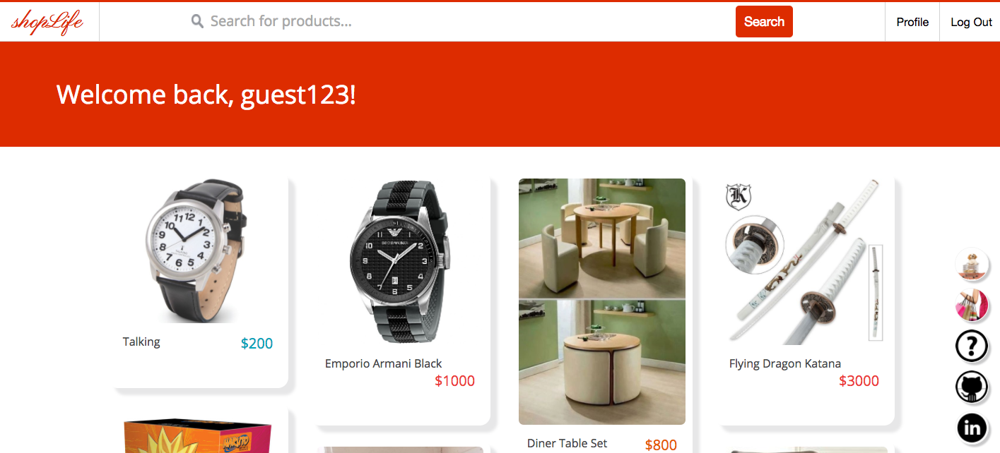

# ShopLife

[ShopLife LIVE!] [heroku-link]
[heroku-link]: https://shoplife.herokuapp.com/

ShopLife is a web application for discovering nearby products and organizing them into your shopping trips. The app is built with Ruby on Rails for backend, React/Redux for frontend, and PostgreSQL for database.

Shoppers nowadays love to check out the physical items before they make a purchase decision (either online or at the store), shopLife is all about enhancing that physical screening aspect of your shopping experience.

## Features & Implementation

### Discover Products on Feeds Page

Once you click onto a product you like, the modal will expand and show the detailed information, including the description, image, and the shop that sells it. If you like the product, you can pin it to an existing trip or create a new one before pinning.

Multiple AJAX requests are fired to complete the modal. First, a request to Product controller to get all the product's detailed information. Second, a request to Trip controller to get all the current user's trips. Third, a request to Pin controller to see which trip has pinned the selected product. In our MODEL, Trip and Product has a many-to-many relationship through Pin.

### Quick Navigation Sidebar

While users can check their trips in the profile page, they can also quickly navigate into one from the sidebar on the left. This sidebar shows five or fewer recently updated trips.

The sidebar is achieved by some CSS tricks, including "position: fixed", "flex-direction", and "z-index".

### Check Pinned Products in a Trip

At its core, shopLife allows users to discover products sold by physical stores. Because listed products are restricted by geophysical location, the shopping trips will display where to buy the pinned products on a map. Hovering on the map marker will highlight the corresponding product. The map is powered by Google Map API embedded in our Map component.

One of the most challenging parts of shopLife is to update multiple components at once. When a user removes a product from a trip, React dispatches one action to the middleware to delete the selected pin in our database; in turn, the success callback dispatches two actions to update the page: first, it removes the product from the product list and second, it decreases the product count by one.

### Profile Page

A user can visit his/her or another user's profile page. This page shows you a summary of Trips, Pins, Followers, and Followings. The "Following" section is further broken into the users, trips, and shops that the profile owner is following.

Many-to-many relationships also exist between different users and users and shops. React router is used in this page for routing.

## Interesting User Experience

### Loading Picture as Placeholder

When a picture is still loading, shopLife displays an animated shopping cart as a placeholder. All of the product pictures are loaded from Cloudinary's CDN. Also, the product frames will adjust their positions into a masonry style when all the pictures are loaded and their positionY and height are calculated.

### Empty Search Result

If a query does not return any search results, shopLife will return a "no result" message and show you a sad face.

### Empty Shopping Trip

If a user clicks into an empty shopping trip, shopLife will show a "Shop Now" button for quick navigation back to home page, instead of rendering an empty list or blank page.

## Error Handling

### Front-end Authentication

If the user has not entered a username or password is too short, the login modal will display the error messages and block users from logging in or signing up. This front-end authentication feature will reduce the traffic load on the server.

### Login Failure

If we could not find the user in our database or there are some other errors not screened by front-end auth, the login modal will display the error message at the top. These are errors that will go through our server and get verified by our MODEL.

## Future Directions for the Project

In addition to the features above, there are a few more bonus features to increase the overall experience of ShopLife.

### Advanced Search

Users are only allowed to search products by their names right now. It's better to allow users search for other users, trips, or shops as well. And keyword/tag search would be another powerful bonus feature.

### Map

Users can add a product from Tokyo and a product from San Francisco into the same trip. This might confuse users as the products are not organized into a "real" and "physical" shopping trip. We can warn the users when they add a product that is too far away from other products in that list.
