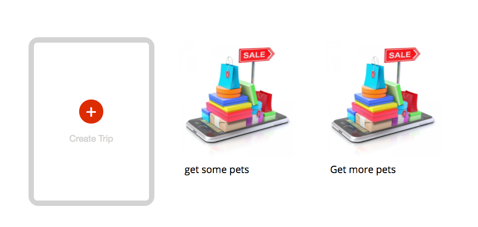

# ShopLife

[Heroku link] [heroku-link]
[heroku-link]: https://shoplife.herokuapp.com/

ShopLife is a web application for discovering nearby products and organizing a shopping trip. It is built with Ruby on Rails, React/Redux for the frontend, and a PostgreSQL database.

## Features & Implementation

### Discover Products on Feeds Page

Users can search for products on the home page.

### Product Show Page

Users can click on a product and look for its details.

### Add Product to a Trip

If a user likes the product, s/he can add it to a shopping trip.

### Profile Page

A user can visit his or her profile page or another user's profile page. The profile page would show a statistics of the profile owner's activities on ShopLife.

### Create a Shop and See the List of Shops

If a user wants to sell something, it is possible to open a new shop on ShopLife. A user can also view another user's list of shops.

### Create a Trip and See the List of Trips

If a user wants to create a new trip, s/he can do it in the profile page. S/he can also see a list of his or her own trips or someone else's trips.

## Future Directions for the Project

In addition to the features above, there are a few more bonus features to increase the overall experience of ShopLife.

### Advanced Search

Users are only allowed to search products by their names right now. It's better to allow users search for other users, trips, or shops as well. And keyword/tag search would be another powerful bonus feature.

### Map

Users should be able to discover the stores and products by location. They should be able to map a trip on Google Map.  
